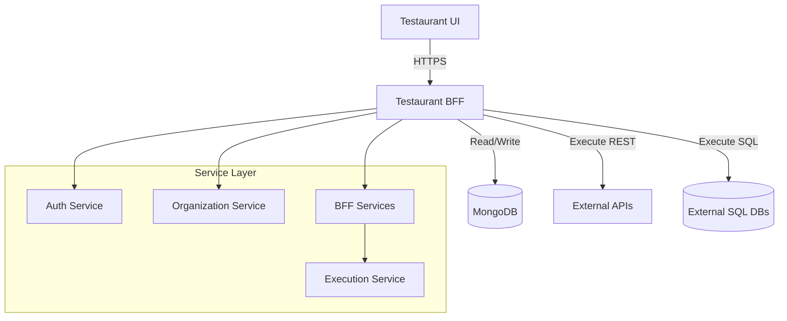
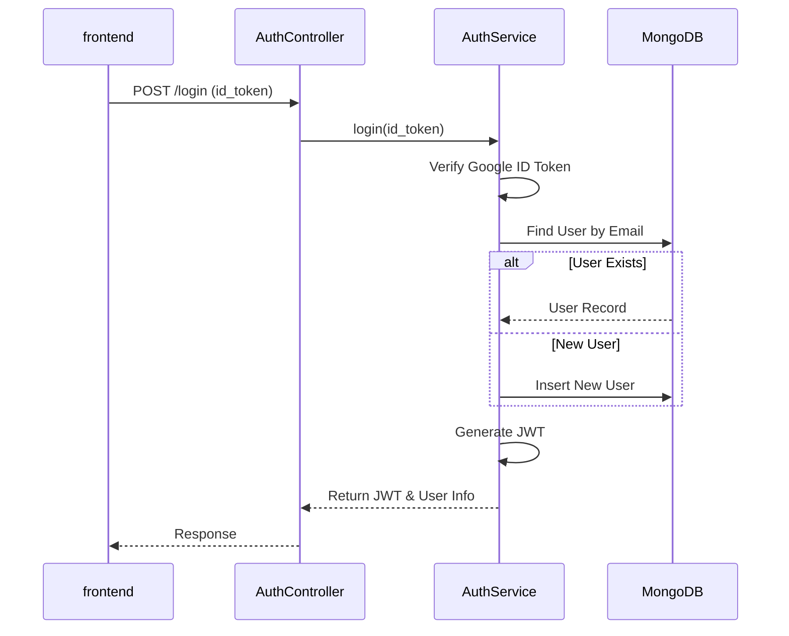
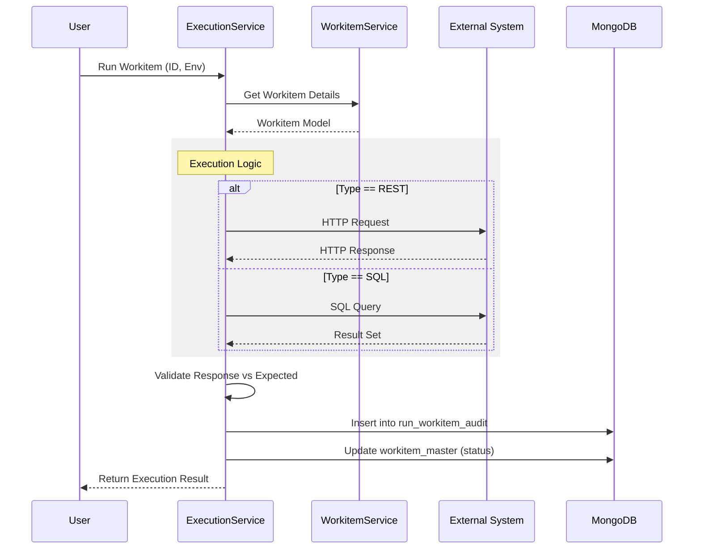

# Low Level Design - Testaurant BFF

## 1. System Overview

Testaurant BFF (Backend for Frontend) is the core service powering the Testaurant platform. It handles authentication, organization management, and the lifecycle of test entities (Workitems, Testcases, Testsuites). It exposes a REST API built with **FastAPI** and interacts with **MongoDB** for persistence.

## 2. Database Design

The system uses **MongoDB** as the primary data store. The database is organized into the following collections.

### 2.1 Collections

| Collection Name | Description | Key Indexes |
| :--- | :--- | :--- |
| [organizations](file:///Users/ashishsingh/Desktop/Testaurant/testaurant_bff/app/controllers/organization_controller.py#34-40) | Stores organization details including teams and DB credentials. | `organization_id` (Unique) |
| `users` | Stores user profiles and Google Auth mapping. | `email` (Unique), `google_id` |
| `workitem_master` | Stores definitions of atomic tasks (REST/SQL/Mongo). | [(organization_id, workitem_id)](file:///Users/ashishsingh/Desktop/Testaurant/testaurant_bff/app/main.py#48-56) (Unique) |
| `testcase_master` | Stores test cases (ordered list of workitems). | [(organization_id, testcase_id)](file:///Users/ashishsingh/Desktop/Testaurant/testaurant_bff/app/main.py#48-56) (Unique) |
| `testsuite_master` | Stores test suites (logical grouping of testcases). | [(organization_id, testsuite_id)](file:///Users/ashishsingh/Desktop/Testaurant/testaurant_bff/app/main.py#48-56) (Unique) |
| `env_config` | Stores environment-specific configurations. | [(organization_id, config_key, environment)](file:///Users/ashishsingh/Desktop/Testaurant/testaurant_bff/app/main.py#48-56) (Unique) |
| `run_workitem_audit` | Execution history for workitems. | `organization_id`, `created_date` |
| `run_testcase_audit` | Execution history for testcases. | `organization_id`, `created_date` |
| `run_testsuite_audit` | Execution history for testsuites. | `organization_id`, `created_date` |
| `counter_master` | Used for generating sequential IDs for entities. | `counter_name` (Unique) |

## 3. High-Level Architecture

## 4. Detailed Component Flows

### 4.1 Authentication Flow

The system uses Google Identity for authentication and JWT for session management.

**Workflow:**
1.  **Frontend** sends Google ID Token to `/auth/login`.
2.  **AuthService** verifies the token with Google servers.
3.  **AuthService** checks if the user exists in `users` collection.
    *   If **New User**: Creates user record, default role `VIEWER`.
    *   If **Existing User**: Updates login timestamp.
4.  **AuthService** generates a JWT containing:
    *   `user_id`
    *   `email`
    *   `organization_id`
    *   [role](file:///Users/ashishsingh/Desktop/Testaurant/testaurant_bff/app/controllers/organization_controller.py#209-220)
5.  **Frontend** receives JWT and attaches it to Authorization header `Bearer <token>` for subsequent requests.

### 4.2 Organization Management

Handles creation of organizations, team management, and member role assignment.

**Create Organization Flow:**
1.  **User** requests `/organization/create`.
2.  **OrganizationService** checks if name is available.
3.  **OrganizationService** creates entry in [organizations](file:///Users/ashishsingh/Desktop/Testaurant/testaurant_bff/app/controllers/organization_controller.py#34-40).
4.  **OrganizationService** creates a default "General" team.
5.  **OrganizationService** updates the creator's `organization_id` and sets role to `ADMIN`.

**Join Request Flow:**
1.  **User** requests `/organization/join/{org_id}`.
2.  **OrganizationService** creates a pending request in the organization's [join_requests](file:///Users/ashishsingh/Desktop/Testaurant/testaurant_bff/app/controllers/organization_controller.py#184-191) array.
3.  **Org Admin** views requests via `/organization/{org_id}/join-requests`.
4.  **Org Admin** approves/rejects via `/handle`.
    *   **Approve**: User is added to [members](file:///Users/ashishsingh/Desktop/Testaurant/testaurant_bff/app/controllers/organization_controller.py#165-172) list, `organization_id` updated in `users` collection.

### 4.3 Core Entity Management (BFF)

Core entities (Workitems, Testcases, Testsuites) follow a uniform CRUD pattern.

**Entity Structure:**
*   **Workitem**: Atomic unit. Types: `REST`, `SQL`, `MONGO`. Contains configuration (URL/Query) and expected response.
*   **Testcase**: Ordered list of Workitems.
*   **Testsuite**: Collection of Testcases.

**Create Flow (Example: Workitem):**
1.  **POST** `/bff/workitems`
2.  **WorkitemService** generates a unique ID (e.g., `WI-1001`) using `counter_master`.
3.  **WorkitemService** constructs [Workitem](file:///Users/ashishsingh/Desktop/Testaurant/testaurant_bff/app/models/workitem_models.py#66-97) object.
4.  **WorkitemService** inserts into `workitem_master`.

**Read Flow:**
1.  **GET** `/bff/workitems`
2.  **WorkitemService** queries `workitem_master` with filters (`organization_id`, `workitem_type`).
3.  **BFF Controller** resolves `created_by` and `last_ran_by` IDs to human-readable names using `UserService`.

### 4.4 Execution Engine

This is the most critical flow, handling the actual running of tests.

**Run Workitem Flow:**
1.  **POST** `/bff/run/workitem/{id}` with `environment` (e.g., QA, PROD).
2.  **ExecutionService** fetches Workitem details.
3.  **ExecutionService** resolves Environment variables (planned feature).
4.  **ExecutionService** executes the logic based on type:
    *   **REST**: Uses `httpx` to make HTTP call.
    *   **SQL**: Connects to external SQL DB using stored credentials.
    *   **MONGO**: Connects to external Mongo DB.
5.  **ExecutionService** captures:
    *   Request/Query sent
    *   Response received
    *   Execution time (`latencyms`)
    *   Status (`PASS`/`FAIL` based on expected response)
6.  **ExecutionService** saves audit log to `run_workitem_audit`.
7.  **ExecutionService** updates `workitem_master` with `last_run_status` and `last_ran_at`.

## 5. Interaction with Database

All database interactions are asynchronous, using `motor`.

1.  **Connections**: Managed by [Database](file:///Users/ashishsingh/Desktop/Testaurant/testaurant_bff/app/database.py#7-93) class in [app/database.py](file:///Users/ashishsingh/Desktop/Testaurant/testaurant_bff/app/database.py). Connects on startup, disconnects on shutdown.
2.  **Queries**:
    *   Standard CRUD: `db.collection.insert_one`, `db.collection.find`, `db.collection.update_one`.
    *   Aggregations: Used for stats (e.g., counting by type).
    *   Pagination: Implemented via `.skip().limit()` in lists.
3.  **Atomic Counters**: Uses `find_one_and_update` on `counter_master` to generate sequential human-readable IDs (WI-1, WI-2...).

## 6. Error Handling

*   **HTTP Exceptions**: Controllers raise `HTTPException` (400, 401, 403, 404) which are caught by FastAPI and returned as standard JSON errors.
*   **Validation**: Pydantic models validate all incoming requests. Invalid payloads return 422 Unprocessable Entity automatically.
